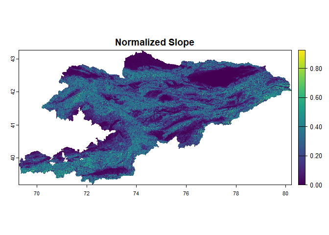

LandslideSusceptibilityR
================

<!-- README.md is generated from README.Rmd. Please edit that file -->

# LandslideSusceptibilityR

**LandslideSusceptibilityR** is an R package that allows users to
generate landslide susceptibility maps with minimal input. The user only
needs to provide a digital elevation model (DEM) and a satellite image
stack for a given area. The package then automatically computes key
causal factors such as slope and NDVI, and uses a pre-trained machine
learning model to generate a susceptibility map.

This package is designed to make landslide modeling fast, consistent,
and accessible using Earth observation data and spatial analysis in R.

## Installation

Install the development version of the package directly from GitHub
using the `devtools` package:

``` r
# If devtools is not already installed:
# install.packages("devtools")

devtools::install_github("Mahnoor-Nadeem-1995/LandslideSusceptibilityR")
```

## Example

``` r
library(LandslideSusceptibilityR)
library(terra)

# Load example raster file paths
slope <- system.file("extdata", "slope.tif", package = "LandslideSusceptibilityR")
ndvi  <- system.file("extdata", "ndvi.tif",  package = "LandslideSusceptibilityR")

# Prepare and normalize raster stack
raster_stack <- prepare_factors(c(slope, ndvi))

# Plot the first raster layer
plot(raster_stack[[1]], main = "Normalized Slope")
```



## Notes

- This README is generated from `README.Rmd` using
  `devtools::build_readme()`.
- Be sure to commit both `README.Rmd` and the generated `README.md` to
  GitHub.
- Make sure the raster files `slope.tif` and `ndvi.tif` are placed in
  the `inst/extdata/` folder so this example runs properly.
